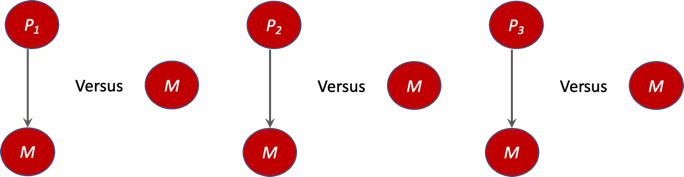

# MBIL

## What is MBIL
## MBIL Algorithm

## Explanation of MBIL Algorithm
1) determine_single_predictors learns the set PA1 of single-variable risk factors of a target T. The procedure does this by determining whether the BDeu score of the model in which the variable has an edge to T is greater than the BDeu score of the model in which T has no parents. 

## Installation

Example of BDeu Score
Chuhan finish