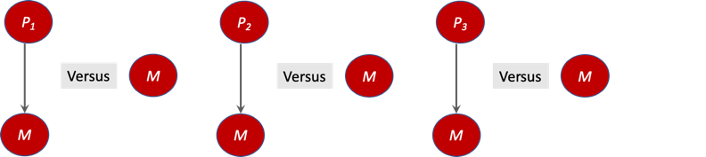
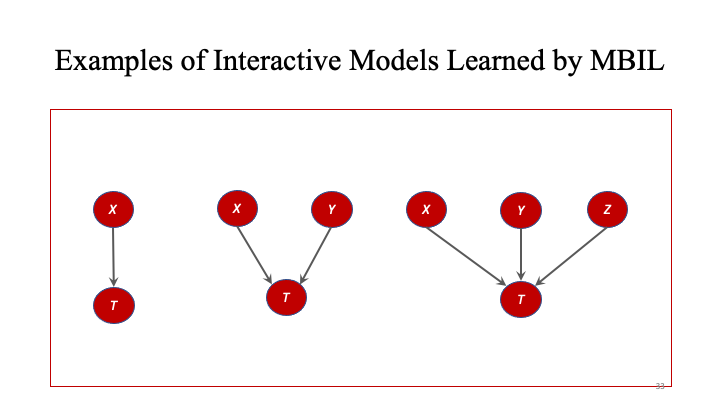

# MBIL
MBIL (Markov Blanket and Interactive risk factor learner) is an algorithm that utilizes Bayesian networks and information theory to determine direct and interactive risk factor for any appropraite dataset and a given target. (See [papers](https://github.com/XiaJiang-2/MBIL/blob/main/docs/BINF-D-19-00613_R2(2).pdf) for details and citations.)

If anything is unclear in this README, it is highly suggested reading the associated paper.

## Install
MBIL can be installed from PyPI:

`pip install mbil-py`

### For all examples shown:
This is the data:
|B|	C|	D|	F|	E|
|-|--|---|---|---|
|2|	1|	0|	1|	0|
|3|	1|	1|	2|	1|
|3|	0|	1|	1|	0|
|3|	0|	1|	1|	1|
|2|	1|	2|	2|	0|

These are the set parameters:

# Add descriptions and ranges for each parameter

`alpha = 4`

alpha is used by the calculate_BDeu function in the scores class and is also known as "equivalent sample size" which is the single hyperparameter when calculating BDeu score. BDeu score calculations are very sensitive to change in this score.
Range: 

`target = "E"`

Target is the variable that is being determined if any other variables are predictors for.

`top = 20`

Top is the maximum size of the list returned by calculate_score which is called by an mbilscore object.

`max_single_predictors = 20`

Max single predictors is the maximum size of the list returned by get_single_predictors_score.

`max_interaction_predictors = 20`

Max interaction predictors is the maximum size of the list returned by get_interaction_predictors_score.

`max_size_interaction = 3`

Max size interaction is used when determining the maximum size of subsets of interactions between predictors. i.e. 3 would mean the subset could contain 3 predictors ["B", "C", "D"]. 

Note: Using too high of max_size_interaction may cause the program to slow drastically.

`threshold = 0.05`

Threshold is used when calculating interaction strength between predictors to determine whether that interaction is a strong enough interaction to influence the target.

`maximum_number_of_parents=7`

Maximum number of parents is used by the directCause object in the detecting_direct_cause function. It sets the upper limit of the number of direct cause parents for the target.

These are the basic direct_cause, score, and search objects:

`direct_cause_obj = mbilsearch.directCause(new_dataset = search_test_object.transformed_dataset, alpha = alpha, target = target, maximum_number_of_parents = maximum_number_of_parents)`

`score_test_obj = mbilscore.mbilscore(dataset_df = dataset_df, target = target, alpha = alpha)`

`search_test_object = mbilsearch.mbilsearch(threshold = threshold, max_single_predictors = max_single_predictors, max_interaction_predictors = max_interaction_predictors, max_size_interaction = max_size_interaction, dataset_df = dataset_df, alpha = alpha, target = target)`

## Functions and Examples

### mbilsearch.get_single_predictors_score

Parameters: The mbilsearch object

Return value: A list of floats with all single predictors whose score is greater than the null score

This function works by taking in the data and parameters set previously and calculates the BDeu score for each predictor and compares it to the null score i.e. if no predictors were present. If the score for said predictor is greater than the null score than it will be added to the list along with its corresponding score.

The BDeu score is a score that measures the probability of the data given the directed acyclic graph using a parameter alpha to represent prior equivalent sample size.

#### Example:

When search_test_object is initialized the single_list_score variable is populated with the list from get_single_predictors_score

`single_list_score = search_test_object.single_list_score`

`print(single_list_score)`

Output:

`[('B', -3.5835189384561104)]`

### mbilsearch.get_interaction_predictors_score

Parameters: The mbilsearch object

Return value: A list of floats with all interaction predictors combinations whose score is greater than the null score

This function works by taking in the data and parameters set previously and calculates the interaction strength between parameters. The number of interactions that can occur i.e. 2 predictors, 3 predictors, etc. is set above and will affect the length of computation time

The interaction is calculated via the calculate_interaction_strength function in mbil score and more details on how this value is calculated can be found there.

#### Example:

Similarly to get_single_predictors_score, get_interaction_predictors_score is called when the mbilsearch object is initialized and its value is stored in the interaction_list_score variable.

`interaction_list_score = search_test_object.interaction_list_score`

`print(interaction_list_score)`

Output:

`[("['B', 'C']", -3.753417975251508), ("['B', 'F']", -4.158883083359674), ("['C', 'D']", -4.382026634673884), ("['D', 'F']", -4.382026634673884), ("['C', 'F']", -4.85203026391962)]`

### direct_cause_obj.detecting_direct_cause

Parameters: The directCause object

Return value: a list of predictors that are a direct cause according to the parent list

This function works by taking in the data and parameters set previously and calculates what single predictors and interactive predictors can be considered direct causes of the target.

#### Example:

As with the other functions, this function is called when a directCause object is initialized and its return value is stored in the direc_cause variable.

`print(direct_cause_obj.direc_cause)`

Output:

`['B']`

